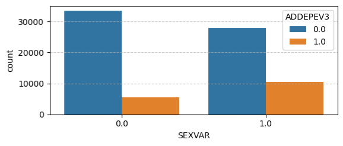
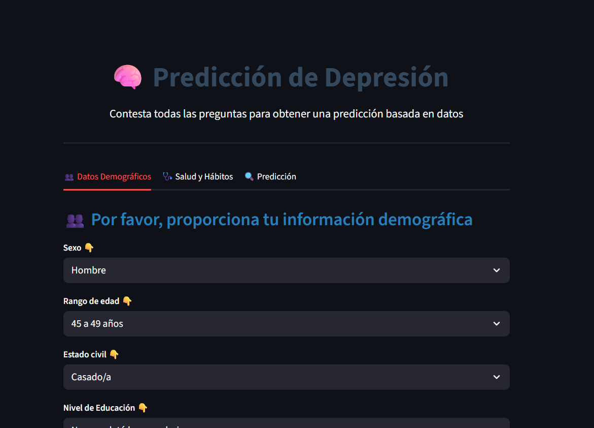
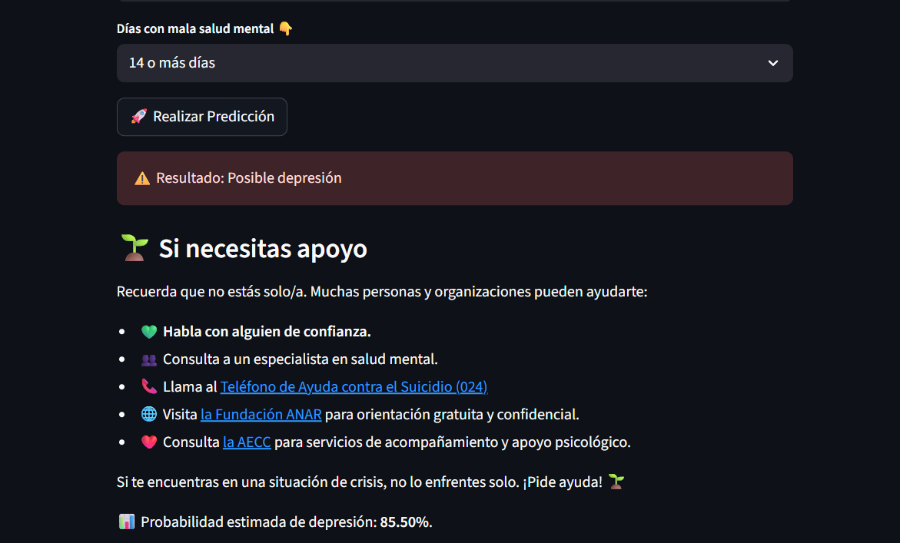

# 🧠 Depression Prediction with BRFSS 2022

## 🎯 Project Objective
The goal of this project is to contribute to the **early prevention of depression** by creating a classification algorithm that predicts it based on a range of factors, such as:

- **Demographic factors** (age, gender, marital status, education level),
- **Physical health and lifestyle habits** (physical activity, sleep quality, consumption habits),
- **Traumatic experiences or risk behaviors**.

This approach aims to support early detection of individuals at risk and facilitate the implementation of preventive strategies within the public health sphere.

---

## 📊 Data Source
The data used in this project comes from the **Behavioral Risk Factor Surveillance System (BRFSS)**, the largest telephone-based health survey in the United States. The BRFSS collects state-level data from residents about:

- Health risk behaviors,
- Chronic disease conditions,
- Use of preventive services.

The **2022 dataset** was selected as it was the latest and most comprehensive version available at the time the project started.

---

## 📋 About the Dataset
The dataset used includes nearly **500,000 survey respondents** and contains **328 variables** (features), covering a wide range of person-related and survey-related information. However:

- Many variables were **irrelevant** to this analysis (e.g., date of the survey, details about how it was conducted, geographic location, etc.).
- A significant number of records had **missing values** or special codes representing **voluntary non-response**, requiring specific treatments for accurate interpretation or elimination.
- Certain variables were **derived calculations** created by BRFSS (e.g., Body Mass Index), calculated from other base questions.

This required a thorough **data preparation and cleaning phase** to ensure that only relevant, high-quality information remained for final analysis.

---

## 🔍 Feature Selection
A **two-stage feature selection process** was performed, reducing the original 328 variables to a final set of 39:

1. **First selection**: We preselected 79 variables based on the relevance of the questions and the variety of dimensions covered (socioeconomic, demographic, lifestyle habits, health status, etc.).
2. **Second selection**:
    - Discarded variables with a **high percentage of nulls** or those coded as non-response.
    - Eliminated redundant variables, prioritizing those calculated by BRFSS that clearly summarized other variables (e.g., BMI or aggregated nicotine consumption metrics).

The final result was a set of **39 features**.

> ⚠️ It's worth highlighting that the analysis was limited to respondents **over the age of 45**, as the available data for younger ages was too sparse and inconsistent. A deeper focus on **missing data treatment** is recommended for future analyses to enable the inclusion of younger populations.

---

## 🔄 Recoding and Data Cleaning
The BRFSS data came **originally coded**, assigning numeric codes for every answer. However:

- The coding lacked a **clear and standardized structure**, especially for ordinal variables, necessitating a **manual recoding** process to:
    - Ensure **binary answers** were standardized (`0 = No`, `1 = Yes`).
    - Properly align **ordinal answers** to reflect logical progression (from lower to higher intensity, frequency, or importance).
- An **outlier analysis** was conducted to detect and remove atypical records, ensuring they didn’t affect the results.

With a sufficiently large sample, this cleaning process didn’t compromise the model’s robustness but resulted in a more coherent, representative, and meaningful dataset.

---

## 📊 Graphical Analysis
A graphical analysis was conducted to evaluate the incidence of each variable relative to the target variable (**ADDEPEV3**) to obtain a preliminary understanding of the key factors in depression prediction.

For example, in the image below, we can observe that **women** (coded as 1) have a higher percentage of depression cases compared to men:

It’s also worth mentioning that the target variable (**ADDEPEV3**) is highly imbalanced, with roughly **80% of the records being negative** and only **20% positive**, which is typical for medical and mental health studies.

This imbalance shaped the modeling approach, especially in selecting metrics that accurately assess the ability of the model to detect positive cases.

---

## 🤖 Modeling and Model Evaluation
Several approaches were tested to obtain a robust, generalizable model that properly handles the imbalance in the target variable. Evaluated methods included:

- Linear Models (**Logistic Regression**, **KNN**),
- Non-Linear Models (**Random Forest**, **XGBoost**, **CatBoost**),
- Simple **Neural Networks**.

The primary goal was to maximize **Recall** and **Precision** while maintaining an acceptable **Accuracy**, as in medical contexts, it is crucial **to minimize false negatives**, even if that means accepting more false positives.

The original imbalanced distribution was kept to best reflect the actual reality of the phenomenon.

After the tuning and testing phase, the best-performing model was **CatBoost** with an optimized threshold, yielding the following results:

### ✅ Final Model Results

| Metric      | Test  | Train |
|--------------|------|------|
| **Accuracy**  | 0.78 | 0.79 |
| **F1 Score**  | 0.57 | 0.59 |
| **Precision** | 0.48 | 0.50 |
| **Recall**    | 0.70 | 0.72 |

These results demonstrate that the final model has a strong ability to detect individuals at risk of depression, achieving roughly **70% Recall**, making it a valuable tool for supporting prevention and early intervention strategies.

---

## 🌐 Streamlit Deployment
Below are some screenshots of the final **Streamlit interface**, where the user can answer questions and obtain a **real-time prediction** along with a **clear and interpretable result**.
https://final-project-datascient.onrender.com/

  
  

---

## ✅ Conclusions
- The BRFSS data enabled the construction of a robust classification model to detect individuals at risk of depression, achieving a **70% Recall** on the test set — a key metric for this medical context where the priority is not to miss cases.
- Careful preprocessing, including variable selection, manual recoding, and outlier detection, was essential for obtaining a clean and meaningful dataset.
- The final model (**CatBoost**) achieved a balanced trade-off between **Recall**, **Precision**, and **Accuracy**, making it a valuable tool for supporting prevention and early intervention efforts in public health settings.
- Maintaining the original imbalanced target variable allows results that realistically reflect the actual distribution of the phenomenon in the population.
- In future work, it would be worthwhile to deepen the treatment of **missing data** to expand the analysis to younger age ranges, especially for assessing depression risk in people under 45.
- The Streamlit deployment provides an **interactive and explanatory tool** that can be integrated into clinical settings to aid professionals in decision-making and facilitate the communication of results to end-users.

---

## ⚡️ Project Limitations
- The analysis is limited to participants **over 45 years old**, as the available data for younger age groups was too sparse and inconsistent for making reliable conclusions.
- The BRFSS dataset is highly imbalanced (**80% negative vs. 20% positive cases**), which can affect the model’s ability to detect all possible risk instances.
- BRFSS data depends on **self-reported information**, which can introduce bias and inaccuracies, especially in subjective variables (e.g., sleep habits, quality of life).

---

## 📚 References
- [Behavioral Risk Factor Surveillance System (BRFSS) - CDC](https://www.cdc.gov/brfss/index.html): BRFSS official site.
- [CatBoost Documentation](https://catboost.ai/docs/concepts/python-reference_catboostclassifier.html): Official documentation for model details and implementation.

---

## ⚖️ License
This project is licensed under the [MIT License](https://opensource.org/licenses/MIT), which means:

- You can use, copy, modify, and distribute this project for any purpose (including commercial).
- You must include a copy of this license along with attribution to the original author.
- The project is offered "as is", **without any warranty** of fitness, reliability, or suitability for any specific purpose.
